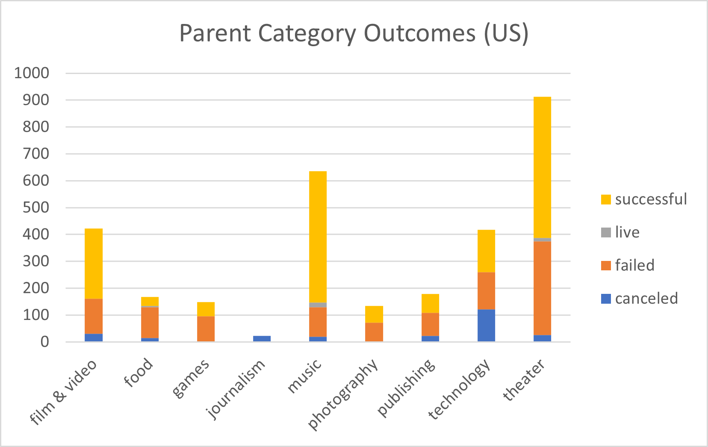
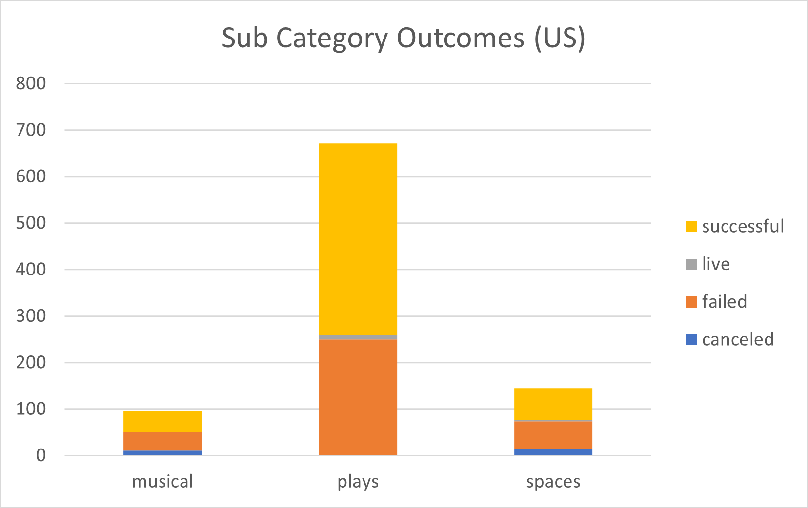
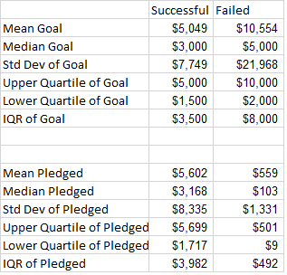
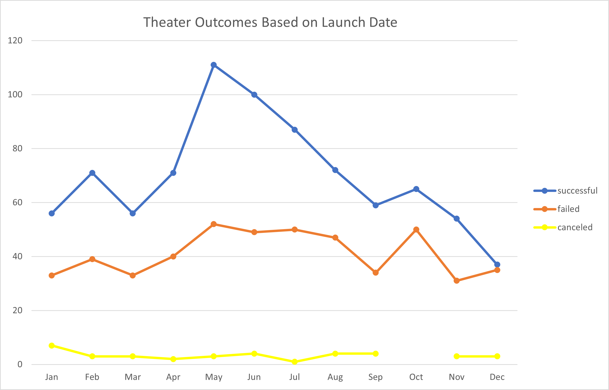
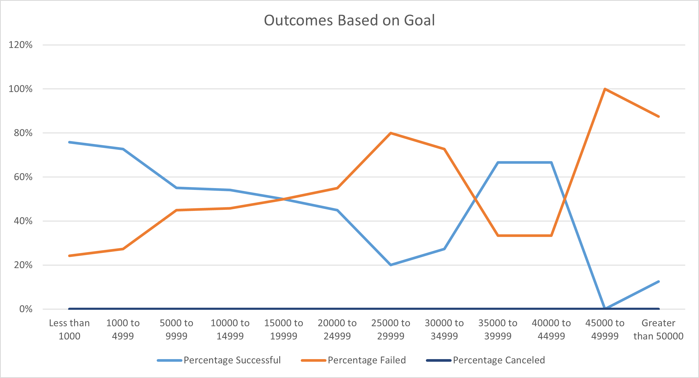

# An Analysis of Kickstarter Campaigns
first excel project for Columbia

## Overview of the Project
The purpose of this project is to help the client (Louise) raise money for a play called Fever that she would like to produce.  Her expected budget is $10,000, and she intends to raise this capital via a Kickstarter campaign.  She would like to use data analysis on prior Kickstarter campaigns to understand how best to execute her campaign in terms of timing, target funding, etc.  She would like to extract best practices from successful campaigns, and apply them to her own.

## Analysis and Challenges

The analysis focused on Kickstarter date from 2009 – 2017.  The data was international is scope, spread across 21 different countries, though the bulk (94%) of the data was in English speaking United States, Great Britain, Canada, Australia.  Further, the data spanned multiple Categories, from the arts through technology.

[Exhibit 1: Parent Category Outcomes](other_resources/Parent_Category_Outcomes.png?raw=true "Outcomes_vs_Goals")

Exhibit 1 charts all categories’ success rates.  It illustrates that the ‘theatre’ category is the most prevalent Kickstarter category, followed distantly by ‘music’.  Theatre success rates are relatively high, though not as high as that of music.

[Exhibit 2: Sub Category Outcomes](other_resources/SubCategory_Outcomes.png?raw=true "Outcomes_vs_Goals")

Exhibit 2 delves deeper into theatre category, illustrating success and failure rates across the subcategories.  As shown, ‘plays’ are the most prevalent Kickstarter campaign within the theatre category, and exhibits a relatively good success rate.

[Exhibit 3: Descriptive Statistics](other_resources/Descriptive_Statistics.png?raw=true "Outcomes_vs_Goals")

Exhibit 3 shows statistics directly relevant to the plays subcategories.  The distribution is right skewed, as evidenced by the upper quartiles all similar to the mean. 

The first insight to be gleaned from this data is that failed campaigns have goals of roughly double those of successful campaigns, and those failed campaigns are of roughly the same size as the proposed budget.  Unsuccessful campaigns are to some extent victims of overreach: the goals are too high.

The second insight is that pledges in unsuccessful campaigns are one tenth the size of successful campaigns.  This proves that the only reason for failure is not overreach in goals, but rather something else is happening.

## Results

### Analysis of Outcomes Based on Launch Date
What are two conclusions you can draw about the Theater Outcomes by Launch Date?

[Exhibit 4: Theatre Outcomes vs Launch](resources/Theatre_Outcomes_vs_Launch.png?raw=true "Outcomes_vs_Goals")
Most theatre campaigns are run in May, as are most successful campaigns, with modest deterioration of success rates through June and July.  Fall and Winter should be avoided.  In particular, December exhibits a much lower success rate and higher failure rate.

### Analysis of Outcomes Based on Goals
What can you conclude about the Outcomes based on Goals?
Outcomes_vs_Goals.png

[Exhibit 5: Outcomes based on Goals](resources/Outcomes_vs_Goals.png?raw=true "Outcomes_vs_Goals")

The best probability of success is in campaigns of less than $1000, but absent that, less than $5000.  While campaigns of larger magnitudes can be successful, the failure rate is commensurately increased.  A campaign of $12,000 is risky, as historical success rates are similar to historical fail rates.

What are some limitations of this dataset?

One limitation is lack of region specificity.  A high goal in NY is not the same as a high goal in AL.  Regional inflation rates are likely embedded in the data set, and should be adjusted for.  

What are some other possible tables and/or graphs that we could create?

It would be interesting to see total failures as a share of total launched during a particular period.
